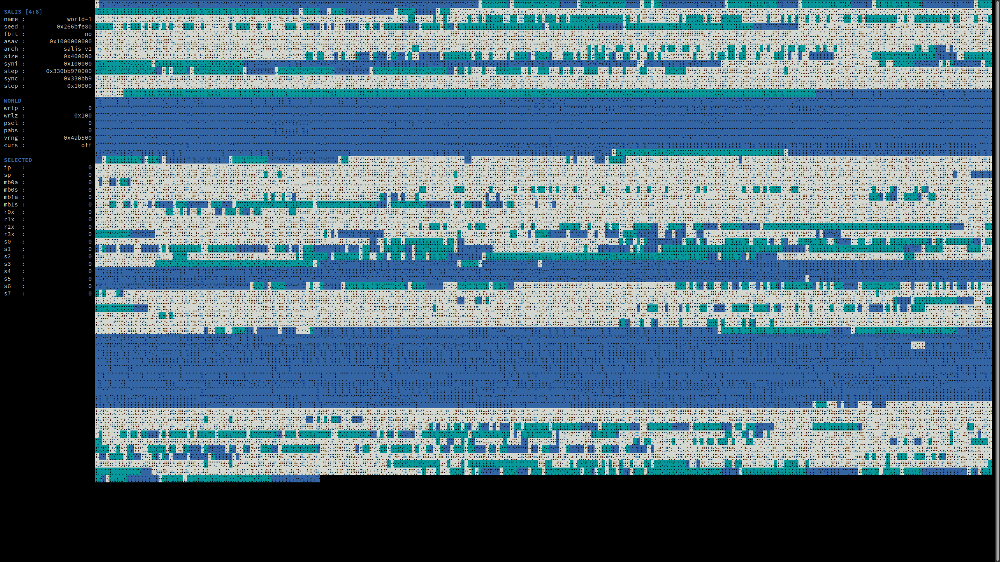

# SALIS: A-life Simulator


*SALIS simulation running on the V1 architecture with the ncurses user interface*

## Overview
*SALIS* is a platform for conducting artificial life experiments. It enables
the development of Tierra-like virtual machines, with certain limitations. For
newcomers, I recommend exploring Tierra first. The following resources provide
valuable context and insight into both the motivations and implementation of
both Tierra and this project:

- [Video about Tierra](https://www.youtube.com/watch?v=Wl5rRGVD0QI)
- [Read about Tierra](http://life.ou.edu/pubs/doc/index.html#What)

## SALIS V1 Reimplementation
A fully functional clone of the V1 architecture for the SALIS virtual machine
has been implemented using the tools available in this repository. For more
information on the V1 architecture, including its similarities and differences
with the original Tierra simulator, check out the following resources:

- [SALIS V1 repository](https://git.pauloliver.dev/salis-v1/about/)
- [SALIS V1 introductory playlist](https://www.youtube.com/watch?v=jCFmOCvy6po&list=PLrEmYrpTcDJY2NdGL6B7wIRbKGp_6NkxY)

## Usage
*SALIS* simulations are initialized using the provided `salis` shell script.
Use `salis new [...]` to start new simulations and `salis load [...]` to load
saved simulations. For a full list of available arguments for each command,
run `salis new --help` and `salis load --help`, respectively.

The shell script compiles a temporary executable on the fly (compilation
typically takes less than a second) based on the specified arguments and
launches it immediately.

Different architectures can be implemented as standalone C files in the
`src/arch/` directory. When creating a new simulation, you can select a
specific architecture using the `--arch` argument.

Similarly, different user interfaces are implemented as C files within the
`src/ui/` directory. For example, the `curses.c` UI launches a terminal-based
simulation visualizer, allowing easy exploration of *SALIS* memory cores and
processes. In contrast, the `daemon.c` UI provides minimal output, making it
ideal for running *SALIS* as a background service. Unlike the `--arch`
argument, you can choose a different `--ui` argument each time you load a
saved simulation.

For example, the following command will launch a new *SALIS* simulation with 4
copies of the `55a` ancestor organisms pre-compiled in each memory core. It
will use the `salis-v1` architecture, run on 8 memory cores, with each core
having a size of 2^22 bytes. The PRNG seed is set to `123456789`:
```console
user@host$ ./salis new -A55a -asalis-v1 -c8 -C4 -m22 -nworld-1 -s123456789 -o
```

Upon exit, the simulation data will be automatically saved to
`${HOME}/.salis/world-1/`. As long as the contents of this directory are not
removed, you can reload the saved simulation with the following command:
```console
user@host$ ./salis load -n world-1 -o
```
